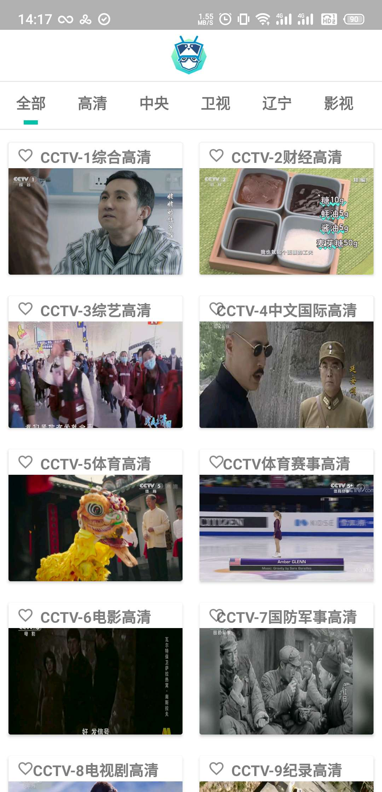

# NEU TV

使用校园网便捷的观看网络电视 Android 移动版

[直视tv 下载链接 v2.2](https://github.com/xfangfang/NeuTV/releases/download/2.2/app-release.apk)

### 简介

直视是一款集成电视直播与回看的Android应用，拥有长达七天的直播视频回看期限，在拥有IPV6校园网络的各个地方都能便捷的观看电视节目。

### 功能

- 频道收藏功能，好看的频道再也不要找不见
- 重绘应用界面，一定要美美美～
- 北影大佬“老头子”制作全新应用图标
- 节目单分类，快读定位您想看的节目
- 播放中切换频道，提升用户体验
- 节目源不好？换！
- 更多功能，敬请期待

### 合作者

[xfangfang](https://github.com/xfangfang)

[timberswift](https://github.com/timberswift)

[tianzhipengfei](https://github.com/tianzhipengfei)

北影 老头子

### 相关APP与交流群
[东大网关君  酷安商店 链接](https://www.coolapk.com/apk/com.lalala.fangs.neunet)

[上网呐 app Store 链接](https://itunes.apple.com/cn/app/%E4%B8%8A%E7%BD%91%E5%91%90/id1245043784?mt=8)

直视&网关君交流群：[532607431](https://shang.qq.com/wpa/qunwpa?idkey=1874e330e0db3e5c4e54794b45a2ac69300786ec03f7ddc44bccb8d9bcfd59f6)

### 致谢

感谢节目源的诸多提供者，以及帮助激励我的老师。
谢谢～

### 版本更新说明

##### V1.0

- 实现基本功能
- 完成第一个应用有点小兴奋

##### v2.0

- 重绘界面，变的多彩多样
- 加入频道收藏与节目单分类
- 重制视频控制器，总算能看的过去了
- 对观看中切换后台进行了小小的优化

##### v2.1

- 增加换源
- 增加主界面刷新范围，减小卡顿
- 增加滑动亮度，滑动音量调节
- 前三次使用应用会显示友善的小提醒
- 修复回看内容切换后台时，切换回来重新播放的BUG

##### v2.2

- 增加app更新提醒，新版本速度更新
- 无回看选项的节目不显示回看按钮
- 修复v2.1版本部分机型无法观看直播的BUG（这个锅应该魅族来背）
- 优化后台切换体验

